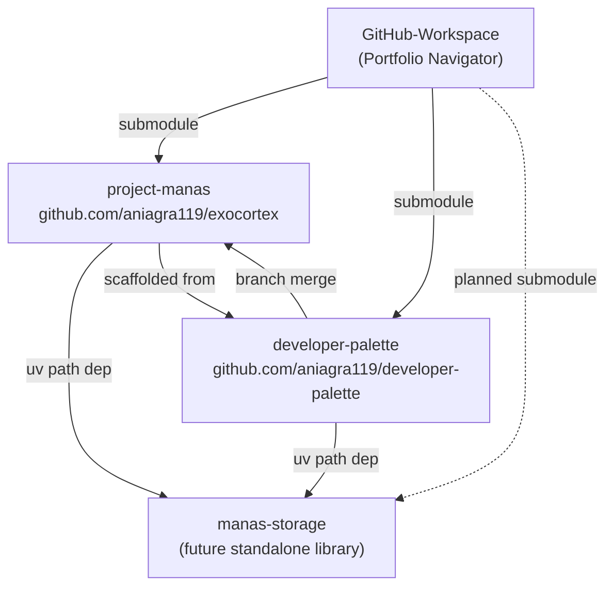

# Exocortex Workspace — Portfolio Navigator

> *"The database that builds itself."*

This workspace is the **root of a multi-repo ecosystem** — a personal AI Operating System built on data sovereignty, conversational interfaces, and clean architecture principles.

All repositories in this ecosystem are independent GitHub projects, linked here via Git Submodules. This document is the single source of truth for how they relate to each other.

---

## Repository Map

```
GitHub-Workspace/                       ← You are here (Portfolio Navigator)
├── project-manas/                      → github.com/aniagra119/exocortex
│   The active AI OS. Translates natural language from Discord into structured
│   data in user-owned Google Sheets. Built on FastAPI + LangGraph + Redis.
│
├── developer-palette/                  → github.com/aniagra119/developer-palette
│   A Git-native scaffolding tool. Maintains base templates and feature
│   integrations (discord, langgraph, fastapi) on orthogonal branches.
│   Projects are built by merging branches — no scaffolding scripts needed.
│
└── [Planned] manas-storage/            → github.com/aniagra119/manas-storage
    A standalone, async Python library implementing the DatabaseClient protocol
    over Google Sheets and SQLite. Zero dependency on LangGraph or Discord.
    Designed to be pip-installable and used independently.
```

---

## Ecosystem Architecture



---

## How the Repos Relate

### `developer-palette` → `project-manas`
`developer-palette` is the **compiler** that generated the initial scaffold of `project-manas`. It maintains orthogonal Git branches for each technology layer:
- `python/base` — FastAPI skeleton + uv config
- `python/feature-discord` — Ed25519 webhook verification, Component UI helpers
- `python/feature-langgraph` — LangGraph StateGraph wiring patterns
- `python/feature-redis` — Redis queue and connection pool setup

When Project Manas needed a new feature, the process was: `git merge developer-palette/python/feature-X`. Git's diff algorithm handles the injection cleanly — no custom scripts, no version drift.

### `manas-storage` → both apps
`manas-storage` is a **pure Python library** containing:
- `DatabaseClient` Protocol (abstract interface)
- `GoogleSheetsClient` implementation
- `SQLiteClient` fallback implementation

Both `project-manas` and `developer-palette` import this library via a `uv` local path reference during development:
```toml
# In either app's pyproject.toml
dependencies = [
    "manas-storage @ file:///Users/anirudhagrawal/Desktop/GitHub-Workspace/manas-storage"
]
```
When deployed or published, the path is replaced with the Git URL. This guarantees **zero Protocol drift** between the live bot and the dev testing tool.

---

## Technology Stack (Shared Across Ecosystem)

| Layer | Technology | Purpose |
|:---|:---|:---|
| Language | Python 3.12+ | Core runtime |
| Package Manager | `uv` | Hyper-fast dependency resolution |
| Web Framework | FastAPI | Async HTTP, webhook handling |
| AI Orchestration | LangGraph | 5-Node ReAct state machine |
| LLM | Gemini / OpenAI | NLP, structured extraction |
| Transport | Discord API | Conversational interface |
| Hot Cache | Redis (Upstash) | Queue, idempotency locks, bootstrap cache |
| Primary Database | Google Sheets | User-owned data sovereignty |
| Fallback Database | SQLite | Local dev / zero-config mode |
| Container | Docker + Compose | Self-hosted persistent worker |
| Versioning | SemVer 2.0 | All Protocol and node contracts |

---

## Versioning Strategy (SemVer Across Repos)

All repos in this ecosystem follow **Semantic Versioning 2.0**:
- `MAJOR` bump → Breaking change to a cross-repo Protocol (e.g. `DatabaseClient` signature change)
- `MINOR` bump → New capability added backwards-compatibly (e.g. new LangGraph node)
- `PATCH` bump → Bug fix, doc update, config change

When `manas-storage` releases a MAJOR version, both `project-manas` and `developer-palette` must pin to that version and migrate explicitly. No silent breakage.

---

## Git Submodule Quick Reference

```bash
# Clone the full workspace including all submodules
git clone --recurse-submodules git@github.com:aniagra119/GitHub-Workspace.git

# Update all submodules to their latest tracked commit
git submodule update --remote --merge

# Work inside a specific submodule (treat it as a normal repo)
cd project-manas
git checkout main
git pull
```

---

## Workspace-Level Documentation

The `/docs` folder at this level contains **macro-level decisions** that span both repositories:

| Document | Description |
|:---|:---|
| [`docs/adr/`](docs/adr/) | Architecture Decision Records — a log of every major technical decision made across this ecosystem |
| [`docs/architecture/`](docs/architecture/) | High-level system maps showing how all repos and external services connect |

> **Note:** Per-project implementation details (node contracts, protocol definitions, data schemas) live inside each repo's own `docs/` folder. The workspace-level docs only cover decisions that affect multiple repos simultaneously.

---

## Portfolio Quick Links

| Project | GitHub | Description |
|:---|:---|:---|
| Project Manas | [exocortex](https://github.com/aniagra119/exocortex) | The AI OS |
| Developer Palette | [developer-palette](https://github.com/aniagra119/developer-palette) | Git-native scaffolding tool |
