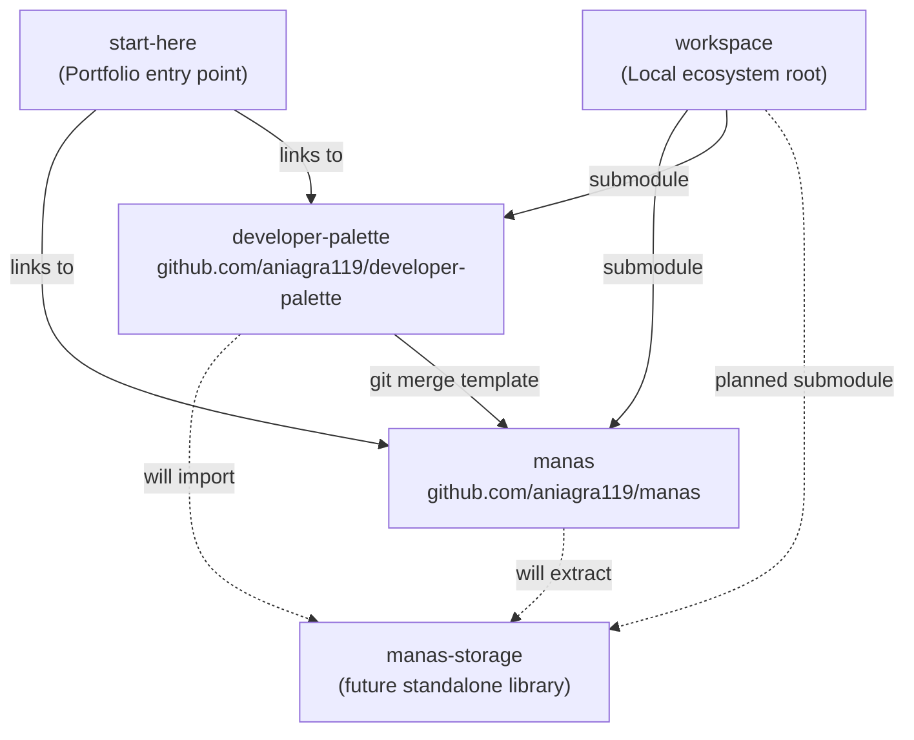

# Exocortex Workspace — Portfolio Navigator

> *"The database that builds itself."*

This workspace is the **root of a multi-repo ecosystem** — a personal AI Operating System built on data sovereignty, conversational interfaces, and clean architecture principles.

All repositories are independent GitHub projects, linked here via Git Submodules. For the public-facing portfolio overview, see [start-here](https://github.com/aniagra119/start-here).

---

## Repository Map

```
GitHub-Workspace/                       ← You are here (local ecosystem root)
│
├── project-manas/          → github.com/aniagra119/manas
│   The active AI OS. Natural language → structured data in user-owned Google Sheets.
│   FastAPI + LangGraph 5-Node ReAct + Redis + Docker.
│
└── developer-palette/      → github.com/aniagra119/developer-palette
    Git-native scaffolding tool. Feature branches merged via git, not scripts.
```

**Public portfolio entry point:** [github.com/aniagra119/start-here](https://github.com/aniagra119/start-here)

---

## Ecosystem Architecture



---

## How the Repos Relate

### `developer-palette` → `manas`
Developer Palette maintains orthogonal Git branches for each technology layer:
- `python/base` — FastAPI skeleton + uv config
- `python/feature-discord` — Ed25519 webhook verification, Component UI helpers
- `python/feature-langgraph` — LangGraph StateGraph wiring patterns
- `python/feature-redis` — Redis queue and connection pool setup

Manas was scaffolded by merging these branches. Future upgrades follow the same pattern — no custom scripts.

### `manas-storage` → both apps *(planned)*
A pure Python library containing the `DatabaseClient` Protocol, `GoogleSheetsClient`, and `SQLiteClient`. Will be extracted into its own repo when `developer-palette` also needs to import it. Until then, it lives inside `manas/libs/`.

---

## Documentation

| Document | Where it lives | What it covers |
|:---|:---|:---|
| Coding execution plan | [`docs/CODING_PLAN.md`](docs/CODING_PLAN.md) | Branch strategy, phase order, library extraction rules |
| Full architecture | [`manas/docs/ARCHITECTURE.md`](../project-manas/docs/ARCHITECTURE.md) | Every system design decision in one place |
| PRD | [`manas/docs/PRD.md`](../project-manas/docs/PRD.md) | User stories and product philosophy |

**Philosophy:** Per-project decisions live inside each project's `docs/`. This workspace-level `docs/` only contains cross-repo concerns (coding plan, ecosystem architecture).

---

## Technology Stack

| Layer | Technology |
|:---|:---|
| Language | Python 3.12+ |
| Package Manager | `uv` |
| Web Framework | FastAPI |
| AI Orchestration | LangGraph |
| LLM | Gemini / OpenAI |
| Transport | Discord API |
| Hot Cache | Redis |
| Primary Database | Google Sheets |
| Fallback Database | SQLite |
| Container | Docker Compose |
| Versioning | SemVer 2.0 |

---

## Git Submodule Quick Reference

```bash
# Clone the full workspace including all submodules
git clone --recurse-submodules git@github.com:aniagra119/workspace.git

# Update all submodules to their latest tracked commit
git submodule update --remote --merge

# Work inside manas (treated as a normal independent repo)
cd project-manas
git checkout main && git pull
```
