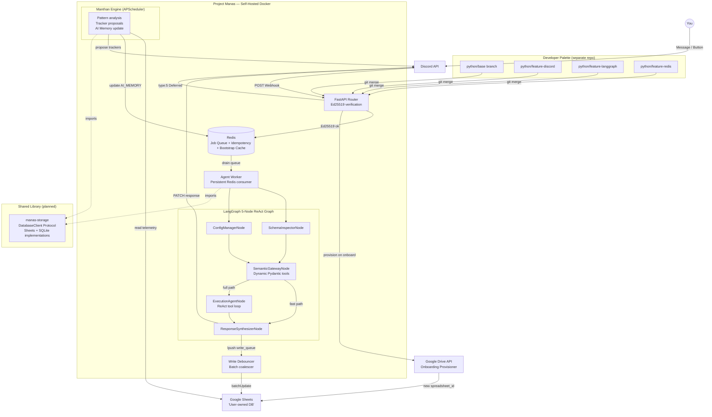

# Exocortex Workspace: High-Level Design (HLD)

> **Scope:** This document describes the macro-level architecture of the entire Exocortex ecosystem — how all repositories, external services, and infrastructure components relate to each other. For implementation details of individual projects, see their own `docs/ARCHITECTURE.md`.

---

## 1. The Ecosystem

This workspace is composed of two active projects and a planned shared library:

| Repo | Role | GitHub |
|:---|:---|:---|
| `project-manas` | The live AI OS | [exocortex](https://github.com/aniagra119/exocortex) |
| `developer-palette` | Git-native scaffolding tool | [developer-palette](https://github.com/aniagra119/developer-palette) |
| `manas-storage` *(planned)* | Standalone async DB client library | *(future repo)* |

---

## 2. Macro Architecture



---

## 3. Key Architectural Decisions

| Decision | ADR | Status |
|:---|:---|:---|
| Self-hosted Docker workers over Lambda | [ADR-0012](adr/0012-self-hosted-docker-architecture.md) | ✅ Accepted |
| Lambda-first serverless approach | [ADR-0001](adr/0001-aws-deployment-strategy.md) | ❌ Superseded |
| Dynamic Pydantic schema generation | [ADR-0002](adr/0002-dynamic-pydantic-schemas.md) | ✅ Active |
| Swappable transport client | [ADR-0003](adr/0003-swappable-discord-client.md) | ✅ Active |
| LangGraph shared state | [ADR-0004](adr/0004-langgraph-shared-state.md) | ✅ Active |
| 5-Node ReAct over 9-Node fan-out | [ADR-0005](adr/0005-layered-agent-graph.md) | ✅ Active |
| Extended data model (_MANAS_* tabs) | [ADR-0006](adr/0006-extended-data-model.md) | ✅ Active |
| Bidirectional Sheets sync | [ADR-0008](adr/0008-bidirectional-sync-and-self-optimization.md) | ✅ Active |
| Background processes & schedules | [ADR-0009](adr/0009-background-processes-schedules.md) | ✅ Active |

---

## 4. Data Flow Summary

1. **Message received** → FastAPI verifies Ed25519 signature → checks Redis idempotency key → pushes to job queue → returns `{type: 5}` to Discord in < 100ms
2. **Worker picks up job** → checks Redis bootstrap cache → runs 5-node LangGraph graph → LLM extracts structured data → writes to Redis write queue → sends Discord response
3. **Write debouncer** → drains write queue in batches → calls Google Sheets `batchUpdate` API (respects 60 req/min quota)
4. **Manthan Engine** (nightly) → reads `_MANAS_META` telemetry → detects patterns → proposes trackers → updates AI memory in Redis

---

## 5. Deployment Topology (Phase 1)

```
Local Machine / VPS
└── docker-compose.yml
    ├── manas-server     (FastAPI, port 9000, public via ngrok/caddy)
    ├── agent-worker     (persistent Python process, drains Redis)
    ├── write-debouncer  (persistent Python process, batches Sheets writes)
    └── redis            (local Redis instance)
```

**Phase 3 graduation path:** Local Docker → ECS Fargate + Upstash Redis + VPC Perimeter + Edge Auth Service. Zero code changes required to the agent graph — only `docker-compose.yml` and environment variables change.
